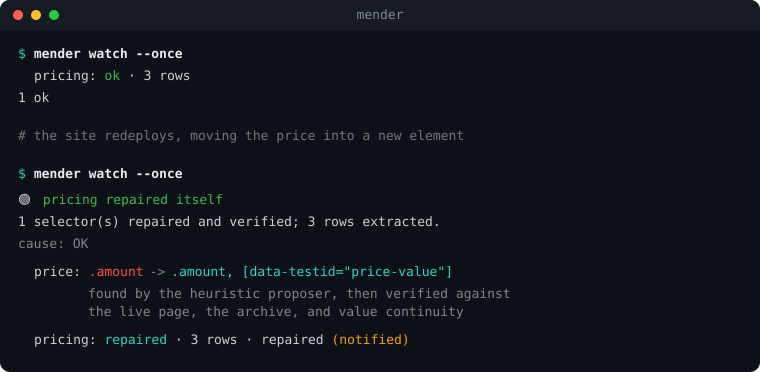

<p align="center">
  
</p>

<p align="center"><b>Scrapers that repair themselves — and refuse to, when repairing would be wrong.</b></p>

<p align="center">
  <a href="https://github.com/daronthedragon/mender/actions/workflows/test.yml"></a>
  
  
  = 20">
  
</p>

---

Scrapers don't crash when they break. They return `[]`, or `null`, or yesterday's price, and the pipeline keeps running for three weeks before anyone notices the data is garbage.

`mender` catches that, works out **why** it happened, repairs the selector when — and only when — the repair can be proved, and tells you either way.

<p align="center">
  
</p>

<details>
<summary>The same session as text</summary>

```
$ mender watch --once
  pricing: ok · 3 rows
1 ok

# the site redeploys, moving the price into a new element

$ mender watch --once
🟢 pricing repaired itself
1 selector(s) repaired and verified; 3 rows extracted.
cause: OK
  price: .amount  ->  .amount, [data-testid="price-value"]   (heuristic)
  pricing: repaired · 3 rows · repaired (notified)
1 ok, 1 repaired
```

</details>

---

## Contents

- [Install](#install) · [Five-minute tour](#five-minute-tour)
- [The idea](#the-idea) — [contracts](#1-a-contract-not-a-selector), [causes](#2-the-cause-classifier-is-the-safety-feature), [unions](#3-repairs-are-unions-not-overwrites), [gates](#4-three-gates)
- [Watch mode](#watch-mode) · [Notifications](#notifications)
- [The model](#the-model-is-optional-and-never-in-the-hot-path) · [Drift](#semantic-drift)
- [Rendering, pagination, auth](#rendering-pagination-and-auth) · [Fixtures](#fixtures)
- [Doctor](#doctor)
- **Reference**: [spec](#spec-reference) · [config](#config-reference) · [CLI](#cli-reference) · [library](#library-reference)
- [CI](#continuous-integration) · [Recipes](#recipes) · [Architecture](#architecture)
- [Performance](#performance) · [FAQ](#faq) · [Troubleshooting](#troubleshooting) · [Limits](#what-it-does-not-do)

---

## Install

```bash
npm install github:daronthedragon/mender
```

Published on npm as **`@daronthedragon/mender`** (the unscoped name was already taken by an unrelated package). Installing from the git URL works today either way — the package's `prepare` script builds it on install.

Zero runtime dependencies. Node ≥ 20. Playwright is optional and only needed for client-rendered pages.

## Five-minute tour

**1. Point it at a page.** No selectors to write:

```bash
npx mender init https://example.com/pricing
```

```
wrote scrapers/pricing.json
  found 3 repeating records matching ".pricing-card"
  proposed 4 field(s): plan_title, amount, features, cta
  dropped 16 redundant column(s) already covered by a field above
  verified: 3 rows pass the generated contract
  archived fixtures/pricing/2026-08-20.html as the first reference
```

You now have a scraper, a contract describing what good data looks like, and a reference snapshot.

**2. Get data:**

```bash
npx mender extract scrapers/pricing.json
```

**3. Keep it alive.** One cycle for an existing cron, or a standing supervisor:

```bash
npx mender watch --once --heal write     # cron-friendly, exits non-zero if broken
npx mender watch --heal write            # runs forever, notifies on change
```

## The idea

A scraper is a bet that a page's shape won't change. `mender` makes that bet explicit, checks it every run, and — when it loses — works out whether the shape genuinely changed or something else went wrong.

```
mender init <url> ─→ a working spec, inferred from the page

run ─→ contract check ─→ pass ─→ drift check ─→ done
            │
            └─ fail ─→ WHY? ─┬─ bot-check page     ─→ back off, selectors untouched
                             ├─ 404 / redirect     ─→ different bug, not a selector
                             ├─ missing credential ─→ config error, not a selector
                             ├─ empty response     ─→ transport, not a selector
                             └─ page fine, data wrong
                                      ↓
                            heuristics propose ─→ (empty?) ─→ model proposes
                                      ↓                            ↓
                                      └──────── 3 gates ───────────┘
                                                 │
                                        fail ────┴──── pass
                                          ↓             ↓
                                report near-misses,  repair + notify
                                change nothing
```

### 1. A contract, not a selector

```json
{
  "name": "pricing",
  "url": "https://example.com/pricing",
  "row": ".pricing-card",
  "fields": {
    "plan":     { "selector": ".plan-title", "type": "string" },
    "price":    { "selector": ".amount",     "type": "number", "min": 1 },
    "features": { "selector": "li",          "type": "list",   "minItems": 3 }
  },
  "expect": { "rows": { "min": 2, "max": 8 } }
}
```

A contract asks *is this shaped like real data*, not *did it throw*. Zero rows, an empty title, a price of `0`, a features list that suddenly has one item — all failures, all silent under a `try/catch`.

This is the part that makes everything else possible. You cannot repair a break you never detected.

### 2. The cause classifier is the safety feature

Most contract failures are **not** layout changes. If you repair selectors against a Cloudflare interstitial, you teach your scraper to extract challenge text — and then it reports itself green. That is strictly worse than staying broken, because it looks fixed.

| Cause | Meaning | Repairs? |
| --- | --- | --- |
| `OK` | Contract satisfied. | — |
| `LAYOUT_CHANGE` | Page served normally, data wrong. | **yes, only this** |
| `BLOCKED` | Challenge page, 403, 429, captcha markers. | no |
| `HTTP_ERROR` | 4xx/5xx, or status `0` for a transport failure. | no |
| `REDIRECTED` | Final URL is a different path. | no |
| `EMPTY` | No rows, almost no text, almost no structure. | no |

```
pricing  BLOCKED  challenge element #challenge-form
  no repair attempted: cause is BLOCKED — selectors left untouched
```

### 3. Repairs are unions, not overwrites

After a real layout change the old markup is gone from the live page, and the new markup was never in your archived snapshots. **No single selector satisfies both**, so demanding one would reject every genuine fix.

```diff
- ".amount"
+ ".amount, [data-testid=\"price-value\"]"
```

The old branch keeps matching pages that used to work; the new branch matches today's. Fixtures stay a usable regression gate instead of a blocker, and selectors accumulate history rather than losing it.

### 4. Three gates

Every proposal — heuristic or model — must clear all three:

| Gate | Question | Catches |
| --- | --- | --- |
| **live** | Does the union clear the violations it targets? | Proposals that don't work. |
| **archive** | Does it extract *byte-identical* data from every stored snapshot? | A new branch that also matches something on the old pages, silently rewriting history. |
| **continuity** | Do the values still mean the same thing? | The wrong element. |

Gate three exists because the first two can both pass on a bad fix. If a price is genuinely gone and a star rating sits nearby, the rating satisfies `type: number, min: 1` today and matches nothing in the archives — gates one and two are happy:

```
unfixed price no candidate passed every gate
  tried .rating-value  rejected at continuity  values now read as numeric,
                                               archived pages had currency,
                                               and the median moved 90% (49 to 4.8)
```

It changes nothing and shows you what it considered. **Continuity checks meaning, not formatting** — `$19` becoming `19.00` or `19 dollars` is accepted as the same value reformatted, because kind is checked first and magnitude decides when kind changes.

## Watch mode

```bash
mender watch --heal write --interval 15m
```

Runs every scraper on a cycle, repairs what it can, reports what it cannot, and backs off targets that are refusing it.

```
watching scrapers every 15m · heal=write · concurrency=4 · notify=slack,file:events.jsonl
  pricing: ok · 3 rows
  jobs: ok · 84 rows
  competitors: blocked · blocked (notified)
1 ok, 1 broken
```

| Behaviour | Why |
| --- | --- |
| Concurrency-bounded | A pool, not `Promise.all`, so 200 scrapers don't open 200 sockets. |
| Backoff | A `BLOCKED` target is skipped for 2, 4, then 8 cycles instead of being hammered while it's refusing you. |
| Crash isolation | A scraper that throws is recorded and the cycle continues. |
| Re-reads specs each cycle | A repair written last cycle is picked up on this one. |
| Durable state | `.mender-state.json` in the fixtures directory; a corrupt one degrades to one duplicate notification, never a stalled watcher. |

`--once` runs a single cycle and exits non-zero if anything is broken, so an existing cron or Kubernetes CronJob needs no wrapper.

## Notifications

The hard part isn't the channel, it's **when to fire**. A monitor that reports the same break every fifteen minutes gets muted within a day, and a muted monitor protects nothing.

State is keyed on the **condition** — the cause plus exactly which targets are broken:

| Situation | Reported? |
| --- | --- |
| First time a scraper breaks | ✅ once |
| Same break, next 40 cycles | ❌ silent |
| A *second* field breaks too | ✅ new incident |
| Repaired itself | ✅ with the diff |
| Back to healthy after a break | ✅ recovered |
| Healthy, and was healthy | ❌ silent |

```json
"notify": {
  "on": ["broken", "repaired", "unrepaired", "recovered", "blocked"],
  "slack":   { "webhookEnv": "SLACK_WEBHOOK_URL" },
  "discord": { "webhookEnv": "DISCORD_WEBHOOK_URL" },
  "webhook": { "urlEnv": "MENDER_WEBHOOK", "headers": { "X-Token": "…" } },
  "file":    { "path": "mender-events.jsonl" },
  "console": true
}
```

Webhook URLs are **named environment variables, never values** — same rule as auth — so the config file stays safe to commit. A channel that's down is reported and skipped rather than taking the run with it. `--notify-always` overrides the transition rule if you want a heartbeat; `--no-notify` silences everything.

The `file` channel is append-only JSONL and never rate-limits, which makes it the one worth always enabling:

```json
{"event":"repaired","scraper":"pricing","url":"…","ts":"2026-08-20T19:58:02.113Z",
 "cause":"OK","detail":"1 selector(s) repaired and verified; 3 rows extracted.",
 "rows":3,"fixes":[{"target":"price","from":".amount",
                    "to":".amount, [data-testid=\"price-value\"]","via":"heuristic"}]}
```

## The model is optional, and never in the hot path

Pointing a model at every page is slow, costs money per request, and returns slightly different answers each time. Here the hot path stays plain deterministic CSS. Heuristics — DOM signatures, text shapes, path similarity — handle breakage first and need no API key. **The model is consulted only when they come up empty.**

```bash
export ANTHROPIC_API_KEY=sk-...
mender repair scrapers/pricing.json --model
```

Its proposals face the identical three gates. Four properties the tests pin down:

- A page the heuristics already solved **never reaches the model** — no token spent on a solved problem.
- A `BLOCKED` page never reaches it either; the classifier stops before any proposer runs.
- A proposal the heuristics already tried isn't verified twice.
- An outage, malformed JSON, or an unparseable selector degrades to *no repair*, never to a wrong one.

The model is told an empty list is a valid answer, and an empty list is honoured rather than second-guessed.

## Semantic drift

If a price starts including tax, every selector matches, every type parses, all three gates pass — and the number is wrong. Structure is checked per run; **meaning can only be checked against the past.**

```
$ mender drift scrapers/pricing.json
pricing: 1 drift finding(s)
  ~ price: median 58.8 is 20% up from a baseline of 49 (MAGNITUDE_SHIFT)
```

That run had **zero contract violations**.

| Signal | Catches | Default |
| --- | --- | --- |
| `MAGNITUDE_SHIFT` | Tax added, currency switched, units changed. | 15% median move |
| `KIND_SHIFT` | `$19` → `19`, a price becoming a phrase. | dominant kind changes |
| `ROW_COUNT_SHIFT` | Silent pagination change, server-side filter. | 50% |
| `NULL_RATE_SHIFT` | A field quietly emptying out. | +30 points |

Drift is **a warning for a human, never a trigger for a repair** — repairing a selector because a price started including tax would be exactly the wrong move, and there's a test asserting it doesn't happen. Archived fixtures seed the baseline so it works from the first run; thin-baseline findings are labelled `provisional`.

## Rendering, pagination and auth

```json
"render":   { "waitFor": ".pricing-card", "waitMs": 200 },
"paginate": { "next": "a.next-page", "maxPages": 10 },
"auth":     { "headerEnv": { "Authorization": "MY_API_TOKEN" } }
```

**Rendering** uses Playwright as an *optional peer dependency*, loaded lazily and only when a spec asks for it, so the default install stays dependency-free:

```bash
npm install playwright && npx playwright install chromium
```

**Pagination** follows next links (resolving relative hrefs) or numbered `urlTemplate`s. `maxPages` is required — an uncapped crawler is a bug, not a feature — and it stops at a repeated URL or the first non-200.

**Auth** names environment variables; specs never hold secrets, and config *rejects* a value that looks like a literal token. Credentials are sent on every paginated page. A missing variable is `HTTP_ERROR` naming the variable, never a layout change — repairing selectors against a login page is exactly what this tool exists to prevent.

Both transports run through one code path, so pagination, auth, loop guards and failure semantics are identical, and a failed render is status `0` like any transport failure.

## Fixtures

A fixture is a page snapshot that passed the contract. They're the regression gate: a repair must keep extracting identical data from every one of them.

```bash
mender fixture scrapers/pricing.json          # archive today (refuses unless passing)
mender fixture scrapers/pricing.json --prune  # retire ones that stopped being useful
```

```
pricing: retiring 2024-01-01 — fails the current spec and is 962 days old
```

Never retires the last passing one — a repair with no reference is what the gate exists to prevent — and keeps *recent* failures, since they may be a fresh break you haven't fixed yet.

---

# Reference

## Spec reference

```jsonc
{
  "name": "pricing",                     // must match the filename stem
  "url": "https://example.com/pricing",
  "row": ".pricing-card",                // omit to treat the document as one row

  "fields": {
    "price": {
      "selector": ".amount",             // evaluated INSIDE the row element
      "type": "number",                  // "string" | "number" | "list"
      "required": true,                  // default true
      "min": 1,                          // number only
      "max": 10000,                      // number only
      "minItems": 3,                     // list only
      "attr": "href"                     // read an attribute instead of text
    }
  },

  "expect": { "rows": { "min": 2, "max": 8 } },

  "auth": {
    "headerEnv": { "Authorization": "MY_TOKEN" },  // header -> env var NAME
    "cookieEnv": "MY_SESSION_COOKIE",
    "basicEnv": { "user": "SITE_USER", "pass": "SITE_PASS" }
  },

  "paginate": {
    "next": "a.next",                    // follow links, OR…
    "urlTemplate": "https://x.com/p={page}",
    "startPage": 1,
    "maxPages": 10                       // required
  },

  "render": { "waitFor": ".card", "waitMs": 200, "engine": "chromium" }
}
```

**Number parsing** handles the formats prices actually appear in: `$1,299.00` → `1299`, `1.299,50 kr` → `1299.5`, `49.99 USD` → `49.99`, `Free` → `null`.

**Selector support**: `tag`, `.class`, `#id`, `[attr]`, `[attr=v]`, `^= $= *= ~= |=`, `*`, the four combinators (descendant, `>`, `+`, `~`), `:not()`, `:first-child`, `:last-child`, `:only-child`, `:nth-child(An+B | odd | even)`, and comma groups. Unknown pseudo-classes never exclude a match.

## Config reference

`mender.config.json` (or `.menderrc.json`, or `--config <file>`). Explicit flags win over it.

```jsonc
{
  "scrapers": "scrapers",
  "fixtures": "fixtures",
  "history": "fixtures",
  "heal": "write",        // false | true (in memory) | "write" (persist)
  "model": false,
  "interval": 900,        // seconds between watch cycles, min 5
  "concurrency": 4,
  "record": true,         // append healthy runs to history, building the baseline
  "drift": { "medianShift": 0.15, "rowShift": 0.5, "minHistory": 3 },
  "notify": { /* see Notifications */ }
}
```

## CLI reference

```
mender watch                     supervise every scraper: check, repair, notify, repeat
mender init <url> [name]         write a spec by inferring it from a live page
mender check   [path]            run every scraper against its contract
mender extract <spec>            print the rows a spec produces, as JSON
mender fixture <spec>            archive today's page as a golden snapshot
mender repair  <spec>            diagnose, propose a fix, verify it, show the diff
mender drift   [path]            report meaning-level drift against run history
mender doctor                    check the setup and say what is wrong with it

options:
  --scrapers <dir>     spec directory                (default: scrapers)
  --fixtures <dir>     snapshot directory            (default: fixtures)
  --config <file>      settings file                 (default: mender.config.json)
  --html <file>        use a local file instead of fetching
  --write              repair: apply the verified fix to the spec
  --only <targets>     with --write: apply only these ("row" for the row selector)
  --pr-body <file>     repair: write a pull-request body
  --model              ask a model when the heuristics come up empty
  --record             append this run to the history file
  --render             init: load the page in a browser first
  --prune              fixture: retire snapshots that stopped being useful
  --max-age-days <n>   fixture --prune: age limit for failing snapshots (default 180)
  --keep <n>           fixture --prune: how many snapshots to keep (default 10)
  --force              fixture: archive even if the contract does not pass
  --json               machine-readable output

watch options:
  --once               run one cycle and exit, for an existing cron
  --interval <dur>     time between cycles: 30s / 15m / 2h   (default 15m)
  --cycles <n>         stop after n cycles
  --concurrency <n>    scrapers to run at once                (default 4)
  --heal [write]       repair automatically; "write" also persists to the spec
  --no-notify          never send, whatever the config says
  --notify-always      send every cycle instead of only on change
```

**Exit codes**: `0` healthy · `1` something is broken or drifting · `2` a usage or configuration error.

## Library reference

```ts
import { scrape, rows, scrapeAll, defineSpec, MenderError } from "@daronthedragon/mender";
```

### `scrape(specOrPath, options) → ScrapeResult`

```ts
const r = await scrape("scrapers/pricing.json", { heal: true });

r.ok          // boolean — contract satisfied, before or after healing
r.rows        // Row[]
r.cause       // "OK" | "LAYOUT_CHANGE" | "BLOCKED" | "HTTP_ERROR" | "REDIRECTED" | "EMPTY"
r.causeDetail // string
r.violations  // Violation[]
r.drift       // DriftFinding[]
r.healed      // { target, from, to, via }[]
r.unhealed    // string[] — broke and could not be repaired
r.spec        // the spec actually used, including in-memory repairs
r.pages       // how many pages were fetched
```

| Option | Default | Meaning |
| --- | --- | --- |
| `heal` | `false` | `true` repairs in memory; `"write"` also persists (needs a path, not an inline spec). |
| `model` | `false` | `true` reads `ANTHROPIC_API_KEY`; or pass your own `ModelClient`. |
| `render` | from spec | Force a browser. |
| `fixtures` / `history` | `"fixtures"` | Directories. |
| `record` | `false` | Append this run to history, building the drift baseline. |
| `html` | — | Use a local string instead of fetching. |
| `archiveFirstRun` | `false` | Save the page as a fixture when a live run is healthy. |
| `onEvent` | — | `(e) => void` for `checked` / `healing` / `healed` / `unhealed` / `drift`. |

### Other exports

| Export | Use |
| --- | --- |
| `rows(specOrPath, opts)` | Just the data. Throws `MenderError` if unsatisfied. |
| `scrapeAll(dir, opts)` | Every spec in a directory, keyed by name. |
| `defineSpec(spec)` | Validates an inline spec and gives editors the type. |
| `runCycle(opts)` / `watch(opts)` | The supervisor, programmatically. |
| `notifiersFrom(cfg)`, `dispatch(...)` | Notification channels. |
| `inferSpec(html, url, name)` | The `init` engine. |
| `parse`, `querySelectorAll` | The HTML parser and selector engine, standalone. |

Healing never mutates the spec object you passed in — asserted by a test.

## Doctor

Everything here depends on setup you cannot see: whether a fixture still passes,
whether history is deep enough to judge drift, whether the environment variable
a spec names is actually exported. When `mender` silently does nothing, the
reason is almost always one of those.

```bash
mender doctor
```

```
ok   specs          1 spec(s) in scrapers, all valid
ok   pricing        1 passing fixture(s)
warn pricing        drift baseline is thin (1 observation(s)); findings will be provisional
                    fix: run with --record so healthy runs build the baseline
warn notify         no notification channels configured, so a break in watch mode is only visible in the log
                    fix: add a "notify" block to mender.config.json
warn heal           healing is off, so a break is reported but never repaired
                    fix: set "heal": "write" in mender.config.json, or pass --heal

no blocking problems, 3 warning(s)
```

Every finding carries the command that fixes it. Errors exit non-zero, warnings
do not, so `mender doctor` is safe to put in a deploy script. It makes no network
requests.

Two findings are worth knowing about because they silently disable repair
entirely: **no fixtures** (a repair has nothing to verify against, so it refuses
to run) and **all fixtures stale** (no known-good reference survives).

## Continuous integration

```yaml
- uses: daronthedragon/mender@main
  with:
    command: check
```

The full loop — check, repair, open a PR with the verified diff:

```yaml
- uses: daronthedragon/mender@main
  id: mender
  with: { command: repair, write: 'true' }
  continue-on-error: true

- uses: peter-evans/create-pull-request@v6
  if: steps.mender.outputs.status == 'repaired'
  with:
    branch: mender/selector-repair
    body-path: ${{ steps.mender.outputs.report }}
```

A ready-made scheduled workflow is in [`.github/workflows/scrape.yml`](.github/workflows/scrape.yml).

## Recipes

**Cron on a box, self-healing, Slack alerts**

```json
{ "heal": "write", "record": true,
  "notify": { "slack": { "webhookEnv": "SLACK_WEBHOOK_URL" },
              "file": { "path": "/var/log/mender.jsonl" } } }
```

```
*/15 * * * * cd /srv/scrapers && npx mender watch --once >> /var/log/mender.log 2>&1
```

**Guard an existing pipeline** — fail loudly rather than write bad data:

```js
import { rows, MenderError } from "@daronthedragon/mender";
try {
  await db.upsert(await rows("scrapers/pricing.json", { heal: true }));
} catch (e) {
  if (e instanceof MenderError) { await pageOncall(e.message); return; }
  throw e;
}
```

**Repairs as pull requests, never silent writes** — drop `--write`, keep `--pr-body`, and let a human merge.

**Behind a login**

```bash
export SITE_COOKIE='session=abc123'
```
```json
"auth": { "cookieEnv": "SITE_COOKIE" }
```

## Performance

The hot path is a hand-written parser and selector engine, so it is measured
rather than assumed. `bench/bench.mjs` runs against a 270 KiB synthetic page
(7,292 elements, 200 records x 12 fields) and the real example pages.

| | before | after | |
| --- | --- | --- | --- |
| parse 270 KiB | 4.90 ms | 2.38 ms | **2.1x** |
| `querySelectorAll(".card")` | 0.65 ms | 0.010 ms | **65x** |
| 12 field selectors x 200 rows | 6.95 ms | 0.26 ms | **26x** |
| `runCheck`, large page | 20.9 ms | 8.6 ms | **2.4x** |
| `propose()` over 200 rows | 103 ms | 3.1 ms | **33x** |
| `runRepair`, 200-row page | 610 ms | 62 ms | **9.9x** |

What did it:

- **A candidate-narrowing index.** Per query root, a lazily built class / tag /
  id / attribute-name index over the descendant array, so a selector only tests
  elements that could possibly match. Built on the *second* query against a
  root, so a root queried once still pays exactly one linear scan.
- **Per-node caches** for descendants, children, text and class lists. The tree
  is immutable after `parse()`, and `descendants()` was rebuilding a whole
  subtree array on every call — quadratic during repair scoring.
- **O(1) sibling positions**, recorded at parse time, so `:nth-child` and the
  sibling combinators stop scanning.
- **Hoisting invariants out of the scoring loop.** Repair scored every
  descendant of every row while recomputing three reductions and four linear
  scans over the exemplar set each time — work that depends only on the
  exemplars. Precomputing it once turned per-element cost into hash lookups,
  which is the single largest win above.

The narrowing index rests on one assumption: an element matching a compound
carries that compound's class, tag, id or attribute name. If a future selector
feature breaks that — `[attr=v i]`, `:is()`, `:where()` — `querySelectorAll`
would silently under-match while `matches()` kept working. That divergence
would be quiet, so it has a permanent guard: `test/equivalence.test.mjs` runs
~9,000 comparisons of the narrowed implementation against an unnarrowed oracle
across every example page and 21 query roots each.

## Architecture

```
cli.ts / api.ts        surfaces
  ├─ watch.ts          the cycle, state, backoff, when to notify
  │    └─ notify.ts    slack / discord / webhook / jsonl / console
  ├─ repair.ts         orchestration: check → classify → propose → verify
  │    ├─ classify.ts  WHY it failed  ← the safety gate
  │    ├─ propose.ts   heuristic candidates from DOM signatures
  │    ├─ llm.ts       model candidates, same gates
  │    └─ verify.ts    live / archive / continuity
  ├─ init.ts           infer a spec from a page
  ├─ history.ts        run stats and drift
  ├─ contract.ts       violations
  ├─ extract.ts        spec + document → rows
  ├─ select.ts         CSS selector engine
  └─ html.ts           tolerant HTML parser
```

Everything below `repair.ts` is pure and synchronous, which is why the test suite runs offline in about a second.

**Why a hand-written parser?** Correctness here is load-bearing, and the hazards are known: raw-text elements whose contents look like markup, void elements that never close, and tags the spec lets you leave open (`<li>`, `<p>`, `<tr>`, `<td>`). All are covered by tests. The cost is a dependency this project doesn't take; the benefit is an install measured in seconds.

## FAQ

**Is this an LLM wrapper?**
No. Heuristics do the work and need no API key; the model is a fallback that faces the same gates. A page the heuristics solve never reaches a model.

**Won't self-repairing scrapers silently produce wrong data?**
That's the failure mode the whole design targets. A repair must clear three gates, only one cause is allowed to trigger one at all, and when nothing can be proved it changes nothing and tells you what it rejected and why.

**What if the site is just blocking me?**
`BLOCKED` — no repair, and watch backs off for 2, 4, then 8 cycles.

**Do I have to use watch mode?**
No. `check`, `repair` and `extract` are standalone, and the library API works inside whatever scheduler you already have.

**Does it handle infinite scroll / login walls / captchas?**
Pagination and auth yes. Infinite scroll no — the browser renders and waits but doesn't interact. Captchas no, deliberately.

**How much does the model cost?**
Nothing until heuristics fail, which for a healthy scraper is a handful of times a year. One repair is one request of a few thousand tokens.

## Troubleshooting

| Symptom | Cause |
| --- | --- |
| `no scraper specs found in …` | Empty directory, or its JSON files aren't specs. Run `mender init <url>`. |
| `no fixtures to learn from` | Repair needs a reference. Run `mender fixture` while it still works. |
| `all N fixtures already fail the current spec` | Snapshots went stale. `mender fixture --prune` after archiving a fresh one. |
| `cause is BLOCKED — selectors left untouched` | Working as intended. Add auth, slow down, or use `render`. |
| `auth: environment variable X is not set` | The spec names `X`; export it. |
| `--model requested but ANTHROPIC_API_KEY is not set` | Warning only; heuristics still run. |
| `this spec asks for browser rendering` | `npm install playwright && npx playwright install chromium`. |
| Repair refused with `rejected at continuity` | It found a candidate that's the wrong *kind* of value. Usually correct — check whether the field genuinely still exists. |

## What it does not do

Named honestly, because a self-healing tool that overstates itself is the worst kind.

- **Inference is a first draft.** `init` proposes types and bounds from one page; read the generated spec.
- **Drift from a thin baseline is noisy** — hence `provisional`.
- **No JS interaction.** The browser renders and waits; it doesn't click, scroll or fill forms, so content behind "load more" is out of reach.
- **Continuity is per-field.** A change that keeps every field plausible alone but breaks the relationship between them — prices shifted one row up — passes everything.
- **No proxy rotation or anti-bot evasion**, deliberately. `BLOCKED` means back off.

## Tests

484 assertions. No network beyond servers the suite starts itself, and no API key — the model path runs through an injected fake client. The browser suite adapts to whether Playwright is present rather than skipping silently, so CI (which has no Playwright) reports a slightly lower count.

```bash
npm test
```

## Contributing

Issues and PRs welcome. Two rules: **no new runtime dependencies**, and every behavioural change carries a test that would fail without it.

MIT © Daron · [Changelog](CHANGELOG.md)
